<h1>Taller 10 - Alfred Ramírez Herrera</h1>

<h2>Información</h2>

Curso: Full Stack Básico - Grupo 1 

Link: https://github.com/KelSlevin/taller-10-full-stack 

<h2>Punto 1: Constantes y Variables</h2>
    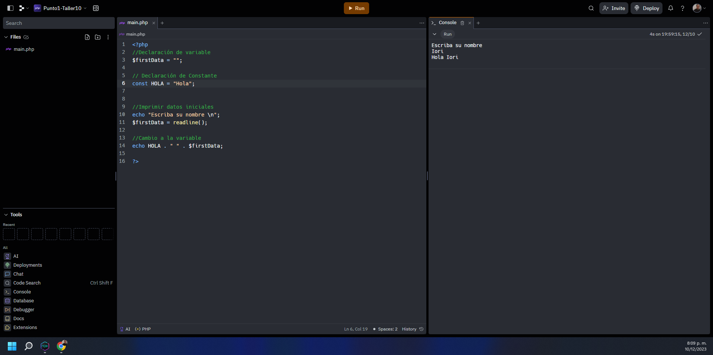
<h2>Punto 2: Suma de constantes y Variables</h2>
    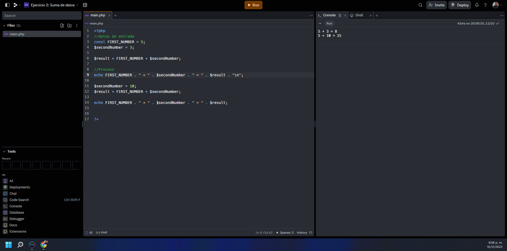
<h2>Punto 3: Suma de dos números indicados por el usuario<h2>
    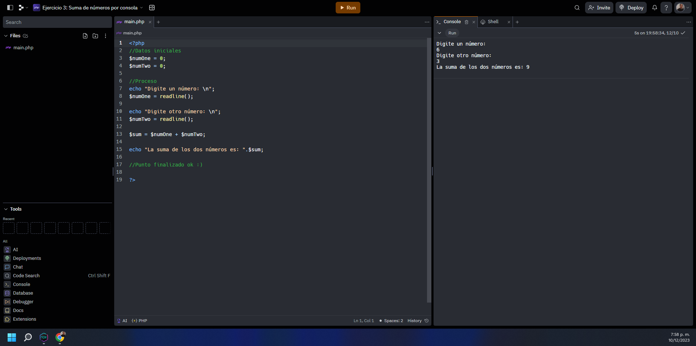
<h2>Punto 4: Datos de los usuarios en consola</h2>
    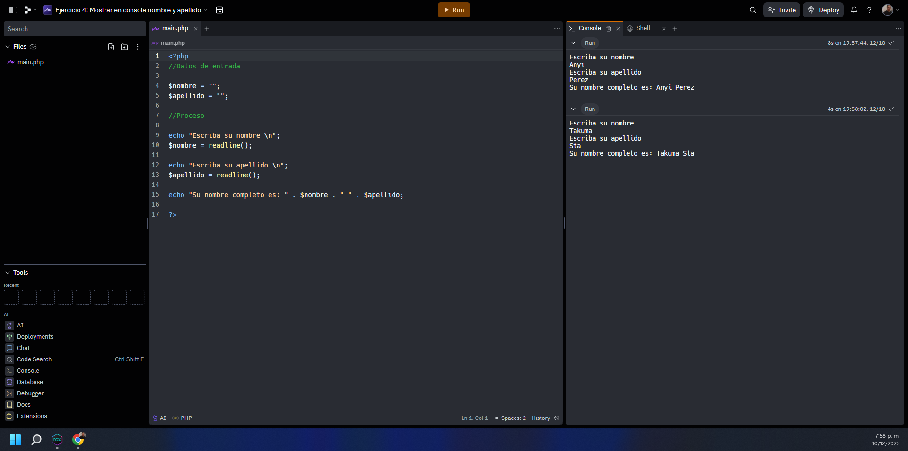
<h2>Punto 5: Entrada de bolera usando if/else</h2>
    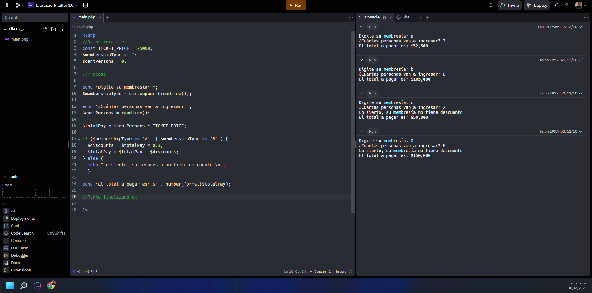
<h2>Punto 6: Detección de mayoría de edad</h2>
    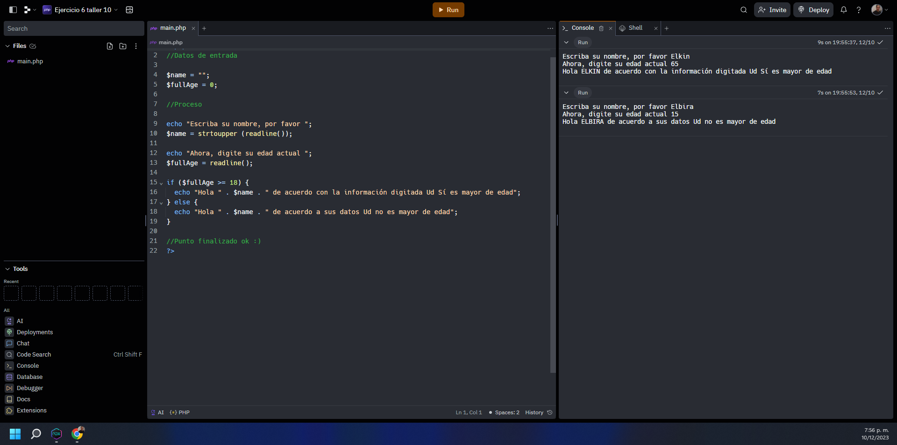
<h2>Punto 7: Selección de operación aritmética</h2>
    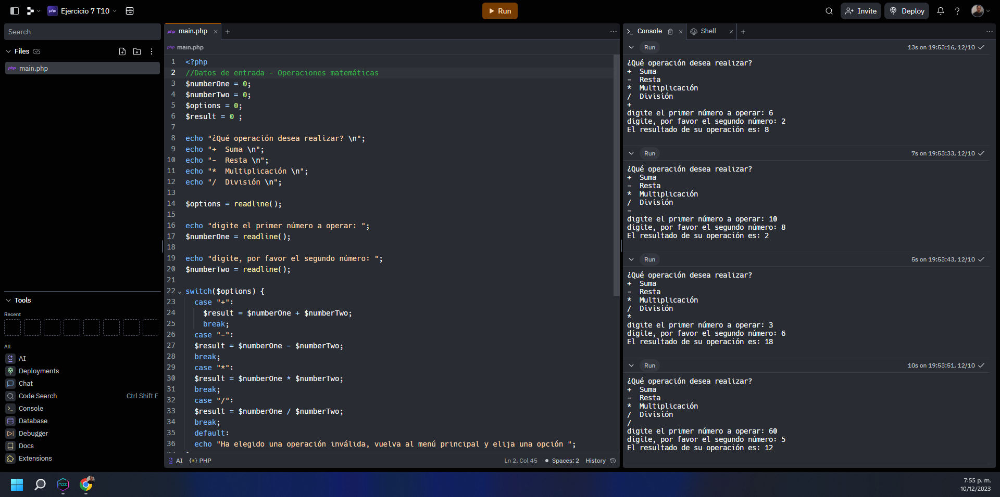
<h2>Punto 8: Entrada de bolera usando Switch</h2>
    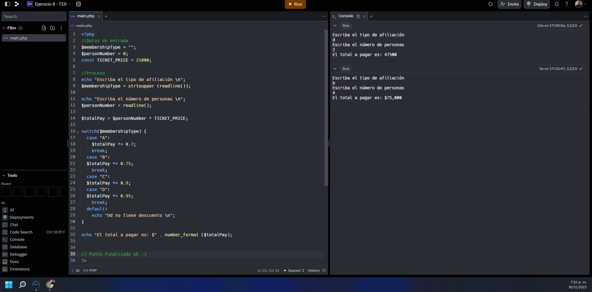
<h2>Punto 9: Tabla de multiplicar usando While</h2>
    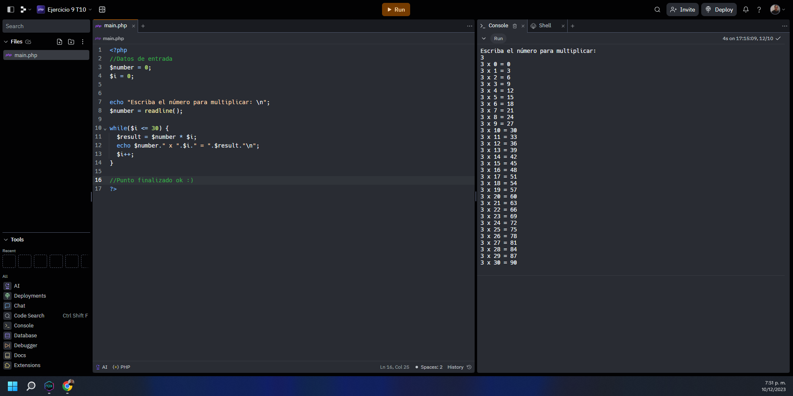
<h2>Punto 10: Constantes y Variables</h2>
    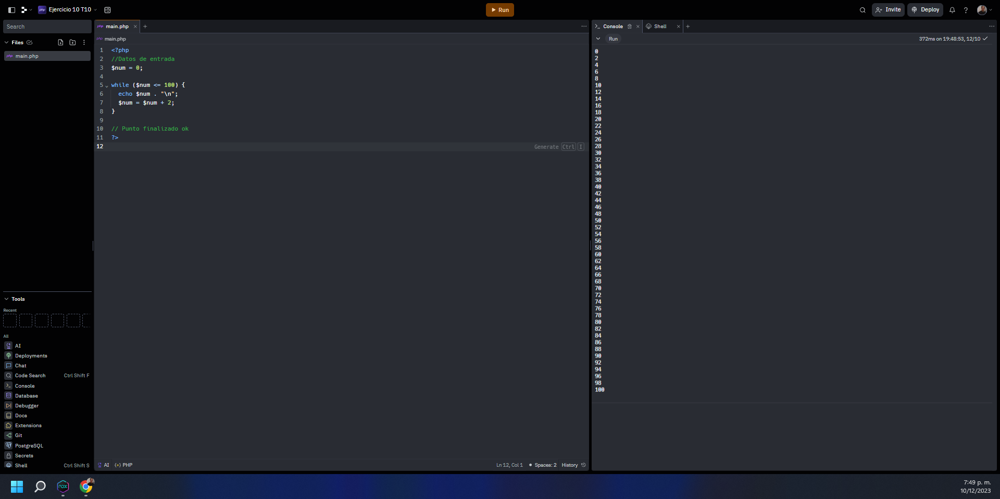
<h2>Punto 11: Números impares usando For</h2>
    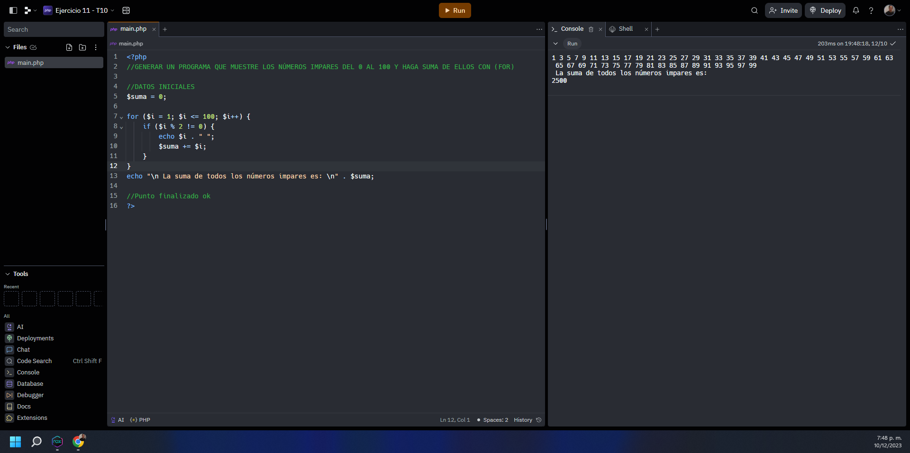
<h2>Punto 12: Tabla de multiplicar usando For</h2>
    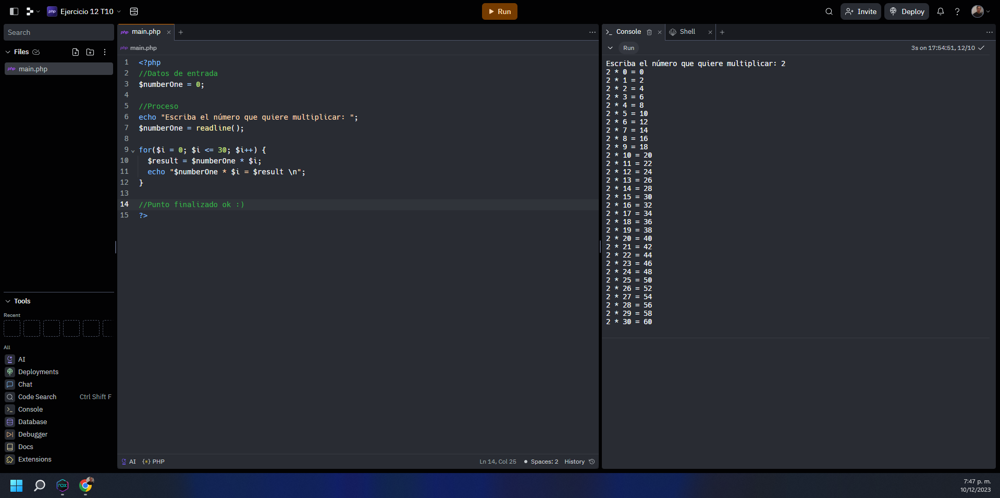
<h2>Punto 13: Suma de valores de un Arreglo usando ForEach</h2>
    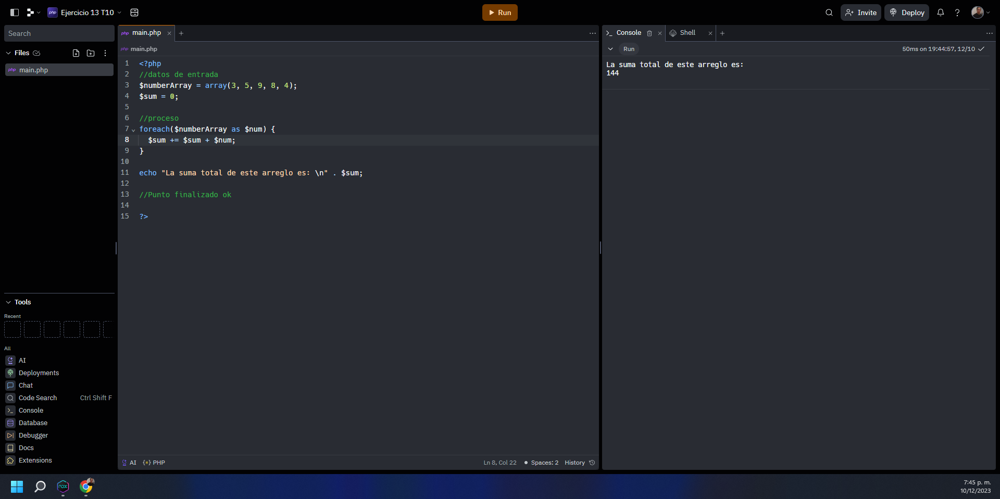
<h2>Punto 14: Revisión de contraseñas</h2>
    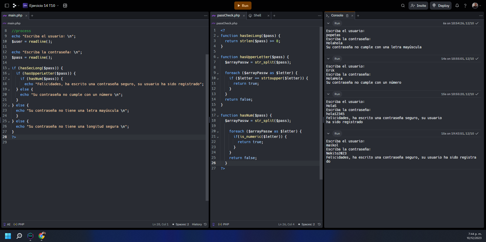
<h2>Punto 15: Selección de operación artitmética Usando funciones</h2>
    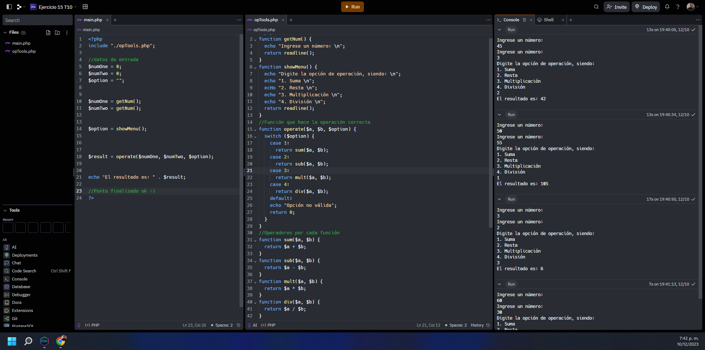
